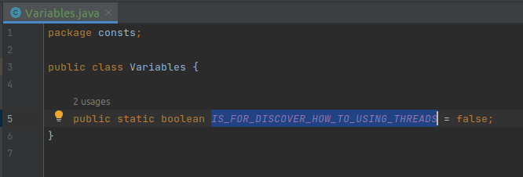
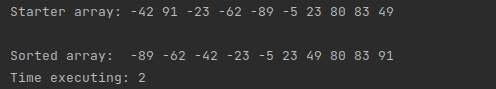
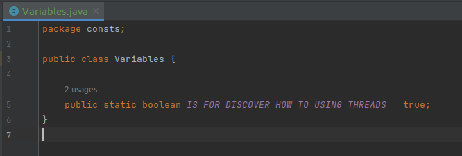
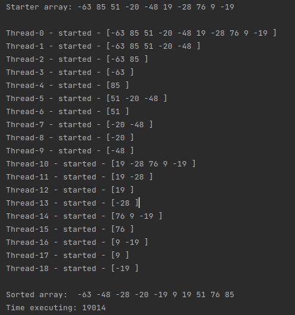

<h1>Concurrently sorting program based on Merge Sort Algorithm</h1>

<h3>Program Services</h3>
<ul>
    <li>SystemLogger - service for program logs</li>
    <li>SystemWriter - service for printing sort results into files</li>
    <li>SortService - service for sorting</li>
</ul>

<h3>How its works?</h3>

<strong style="color: red; text-transform: uppercase">!!!This program use generated array with 10 random values from -100 to 100</strong>

This program use merge sort algorithm with auto-creating threads for every array division.

<h3>Configuration</h3>
If you want to use program for sort without thread-discovering in class <strong>consts/Variables</strong> you should to change variable
<strong>IS_FOR_DISCOVER_HOW_TO_USING_THREADS</strong> = false

And then you will get result like this:

If you want to use program for sort with thread-discovering in class Variables you should to change variable
<strong>IS_FOR_DISCOVER_HOW_TO_USING_THREADS</strong> = true

And then you will get result like this:

<strong>You can also change pause time for thread-discovering mode<strong>